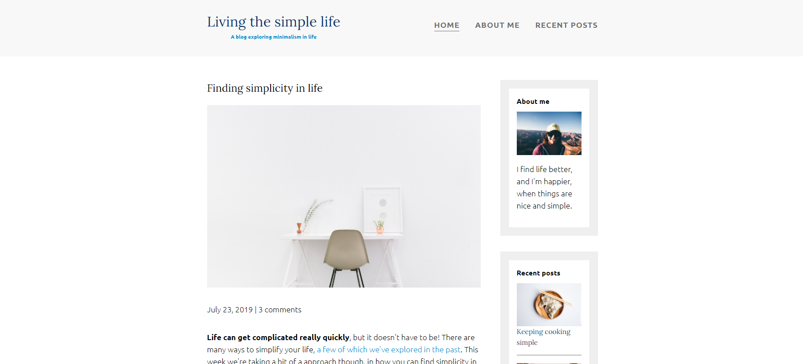

## Simple site 1 
*not an original design *

## Summary

A simple site I created by following a tutorial on flexbox.

 

 

 

 

The page is responsive with one mobile breakpoint, and will stack content on smaller screens.

 

 

The first of several website projects that I've been creating, to get practice in between portfolio projects to keep sharp with the basics.

**Author**
 
**Robin Fussell** _- Software Developer_ | [LinkedIn](https://www.linkedin.com/in/robin-fussell17/)
